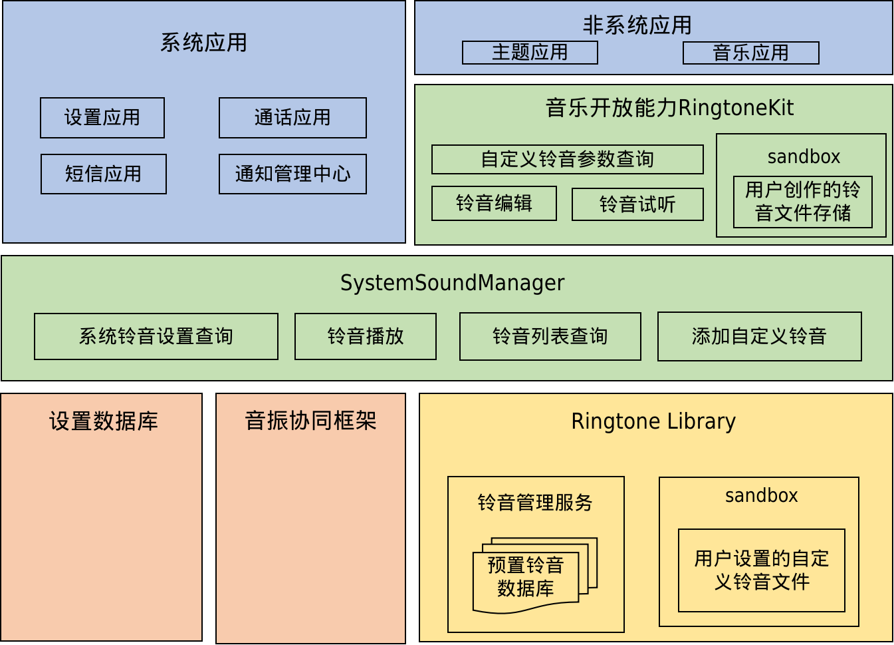

# RingtoneLibrary

- [Introduction](#section1158716411637)
- [Directory Structure](#section161941989596)
- [Repositories Involved](#section1533973044317)

## Introduction<a name="section1158716411637"></a>
**Figures 1** ringtonelibrary architecture

**ringtone\_library** repository provides a set of easy-to-use APIs for setting and getting ringtone information.
RingtoneLibrary APIs can only be used internally, not exposed to public application currently.

The various capabilities can be categorized as below:
- Read ringtone information
- Set and remove customized ringtone
- Read ringtone list, include system ringtone and customized ringtone
- Scan the system prebuilt ringtone directories

## Directory Structure<a name="section161941989596"></a>
The structure of the repository directory is as follows:
```
/foundation/multimedia/ringtone_library/   # RingtoneLibrary code
├── frameworks                             # Framework code
├── interfaces                             # API implementation
│   └── inner_api                          # Internal Native API implementation
├── LICENSE                                # License file
├── services                               # RingtoneLibrary function implementation
│   ├── ringtone_backup                    # RingtoneLibrary backup implementation
│   ├── ringtone_data_extension            # DatashareExtension implementation
│   ├── ringtone_dfx                       # DFX implementation
│   ├── ringtone_helper                    # Helper class
│   └── ringtone_scanner                   # Scanner implementation
└── test                                   # Test code
```

## Repositories Involved<a name="section1533973044317"></a>
**[multimedia/ringtone_library](https://gitee.com/openharmony/multimedia_ringtone_library)**
