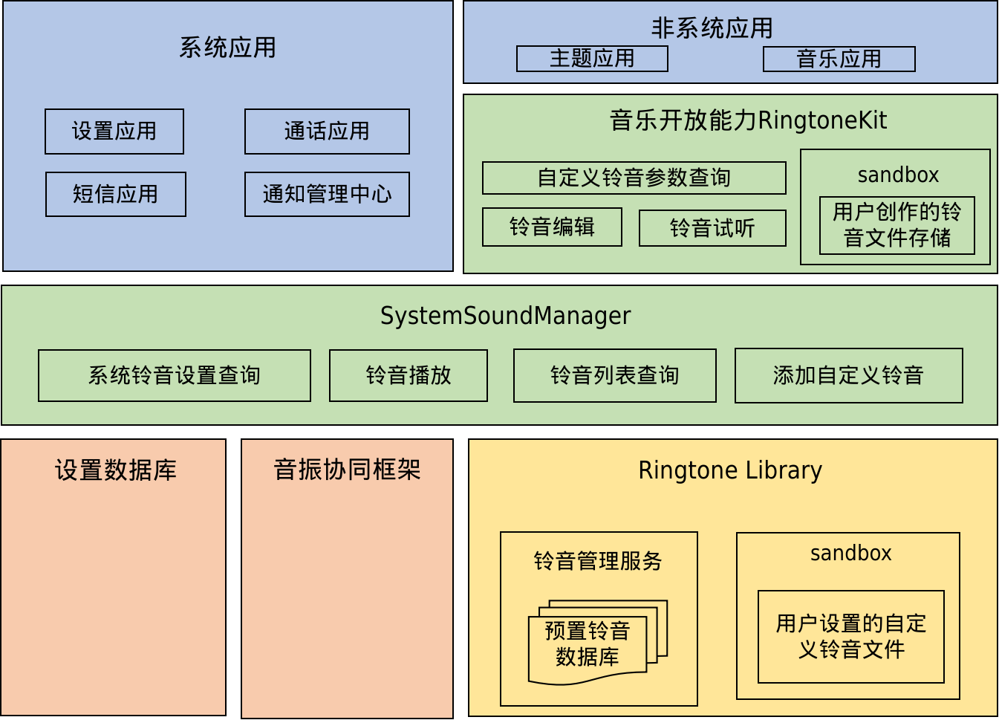

# RingtoneLibrary组件

- [简介](#section1158716411637)
- [目录](#section161941989596)
- [使用说明](#usage-guidelines)
- [相关仓](#section1533973044317)

## 简介<a name="section1158716411637"></a>
**图1** RingtoneLibrary组件架构图

**ringtone\_library** 仓库提供了一系列易用的接口用于设定及获取系统铃音信息。
RingtoneLibrary接口仅内部使用。

支持能力列举如下：
- 读取铃音内容
- 存储和删除自定义铃音
- 读取铃音列表，包含系统铃音和自定义铃音
- 扫描系统预制铃音目录

## 目录<a name="section161941989596"></a>
仓库目录结构如下：
```
/foundation/multimedia/ringtone_library/   # 铃音库组件代码
├── frameworks                             # 框架代码
├── interfaces                             # 接口代码
│   └── inner_api                          # 内部native接口
├── LICENSE                                # 证书文件
├── services                               # 铃音库服务实现
│   ├── ringtone_backup                    # 铃音库备份升级服务
│   ├── ringtone_data_extension            # 扩展插件接口
│   ├── ringtone_dfx                       # DFX实现
│   ├── ringtone_helper                    # 辅助类
│   └── ringtone_scanner                   # 扫描功能实现
└── test                                   # 测试代码
```

## 使用说明<a name="usage-guidelines"></a>
### 概述
提供铃音列表的增、删、改、查等接口，
接口参数主要有对象类型的Uri、DataSharePredicates和DataShareValuesBucket等。

使用接口功能前，需要先获取DataShareHelper
```cpp
auto saManager = SystemAbilityManagerClient::GetInstance().GetSystemAbilityManager();
auto remoteObj = saManager->GetSystemAbility(systemAbilityId);
std::shared_ptr<DataShare::DataShareHelper> datashareHelper = DataShare::DataShareHelper::Creator(remoteObj, "datashare:///ringtone/ringtone");
```

### 铃音列表
#### datashareHelper->Insert(const Uri &uri, const DataShareValuesBucket &value);
- 接口说明

  新增铃音

- insert参数描述

  | 名称     | 读写属性 | 类型                   | 必填 | 描述                           |
  | -------- | -------- | ---------------------- | ---- | ------------------------------ |
  | uri      | 只读     | Uri&                 | 是   | 具体操作的uri     |
  | value    | 只读     | DataShareValuesBucket& | 是   | 数据库字段key-value对象 |

返回值为 来电铃音id

- 示例
    ```cpp
    Uri ringtoneUri("datashare:///ringtone/ringtone");
    int32_t index = 0;
    const int32_t count = 10;
    const int64_t ringtoneSize = 1022;
    const int type = 2;
    const int64_t addedTime = 1559276453;
    const int64_t modifiedTime = 1559276455;
    const int64_t takenTime = 1559276457;
    const int durationTime = 112;
    DataShareValuesBucket valuesBucket;
    valuesBucket.Put(RINGTONE_COLUMN_DATA,
            static_cast<string>("/path_to_target/test_ringtone.ogg"));
    valuesBucket.Put(RINGTONE_COLUMN_SIZE, static_cast<int64_t>(ringtoneSize));
    valuesBucket.Put(RINGTONE_COLUMN_DISPLAY_NAME, static_cast<string>("test_ringtone.ogg");
    valuesBucket.Put(RINGTONE_COLUMN_TITLE, static_cast<string>("test_ringtone"));
    valuesBucket.Put(RINGTONE_COLUMN_MEDIA_TYPE, static_cast<int>(type));
    valuesBucket.Put(RINGTONE_COLUMN_TONE_TYPE, static_cast<int>(type));
    valuesBucket.Put(RINGTONE_COLUMN_MIME_TYPE, static_cast<string>("ogg"));
    valuesBucket.Put(RINGTONE_COLUMN_SOURCE_TYPE, static_cast<int>(1));
    valuesBucket.Put(RINGTONE_COLUMN_DATE_ADDED, static_cast<int64_t>(addedTime));
    valuesBucket.Put(RINGTONE_COLUMN_DATE_MODIFIED, static_cast<int64_t>(modifiedTime));
    valuesBucket.Put(RINGTONE_COLUMN_DATE_TAKEN, static_cast<int64_t>(takenTime));
    valuesBucket.Put(RINGTONE_COLUMN_DURATION, static_cast<int>(durationTime));
    valuesBucket.Put(RINGTONE_COLUMN_SHOT_TONE_TYPE, static_cast<int>(1));
    valuesBucket.Put(RINGTONE_COLUMN_SHOT_TONE_SOURCE_TYPE, static_cast<int>(type));
    valuesBucket.Put(RINGTONE_COLUMN_NOTIFICATION_TONE_TYPE, static_cast<int>(1));
    valuesBucket.Put(RINGTONE_COLUMN_NOTIFICATION_TONE_SOURCE_TYPE, static_cast<int>(type));
    valuesBucket.Put(RINGTONE_COLUMN_RING_TONE_TYPE, static_cast<int>(1));
    valuesBucket.Put(RINGTONE_COLUMN_RING_TONE_SOURCE_TYPE, static_cast<int>(type));
    valuesBucket.Put(RINGTONE_COLUMN_ALARM_TONE_TYPE, static_cast<int>(1));
    valuesBucket.Put(RINGTONE_COLUMN_ALARM_TONE_SOURCE_TYPE, static_cast<int>(type));
    int32_t ret = dataShareHelper->Insert(ringtoneUri, valuesBucket);
    ```

#### datashareHelper->Delete(const Uri &uri, const DataSharePredicates &predicates);
- 接口说明

  删除铃音

- Delete参数描述

  | 名称         | 读写属性 | 类型                    | 必填 | 描述                           |
  | --------     | -------- | ---------------------- | ---- | ------------------------------ |
  | uri          | 只读     | Uri&                 | 是   | 具体操作的uri          |
  | condition    | 只读     | DataSharePredicates&    | 是   | 删除条件              |

返回值为删除的铃音数量

- 示例
    ```cpp
    Uri ringtoneUri("datashare:///ringtone/ringtone");
    DataShare::DataSharePredicates deletePredicates;
    deletePredicates.SetWhereClause(RINGTONE_COLUMN_TONE_ID + " = ? ");
    deletePredicates.SetWhereArgs({ to_string(1) });
    int32_t ret = g_dataShareHelper->Delete(ringtoneUri, deletePredicates);
    ```

#### datashareHelper->Update(const Uri &uri, const DataSharePredicates &predicates, const DataShareValuesBucket &value);
- 接口说明

  修改铃音

- Update参数描述

  | 名称         | 读写属性 | 类型                    | 必填 | 描述                           |
  | --------     | -------- | ---------------------- | ---- | ------------------------------ |
  | uri          | 只读     | Uri&                 | 是   | 具体操作的uri          |
  | condition    | 只读     | DataSharePredicates&    | 是   | 更新条件               |
  | value        | 只读     | DataShareValuesBucket& | 是   | 数据库字段key-value对象 |

返回值为修改的铃音数量

- 示例
    ```cpp
    Uri ringtoneUri("datashare:///ringtone/ringtone");
    DataShare::DataSharePredicates updatePredicates;
    updatePredicates.SetWhereClause(RINGTONE_COLUMN_TONE_ID + " = ? ");
    updatePredicates.SetWhereArgs({ to_string(1) });
    DataShareValuesBucket updateValuesBucket;
    updateValuesBucket.Put(RINGTONE_COLUMN_SHOT_TONE_TYPE, 0);
    updateValuesBucket.Put(RINGTONE_COLUMN_SHOT_TONE_SOURCE_TYPE, 0);
    int32_t ret = dataShareHelper->Update(ringtoneUri, deletePredicates, updateValuesBucket);
    ```

#### datashareHelper->Query(const Uri &uri, const DataSharePredicates &predicates, std::vector<std::string> &columns, DatashareBusinessError &businessError);
- 接口说明

  查询铃音

- Query参数描述

  | 名称             | 读写属性 | 类型                    | 必填  | 描述                           |
  | --------         | -------- | ---------------------- | ----  | ------------------------------ |
  | uri              | 只读     | Uri&                 | 是    | 具体操作的uri        |
  | condition        | 只读     | DataSharePredicates&   | 是    | 查询条件             |
  | resultColumns    | 读写     | std::vector<std::string>& | 是    | 需要查询的列字段名称   |
  | businessError    | 读写     | DatashareBusinessError& | 是   | 异常代码 |

返回值为ResultSet结果集

- 示例
    ```cpp
    Uri ringtoneUri("datashare:///ringtone/ringtone");
    int errCode = 0;
    DatashareBusinessError businessError;
    DataSharePredicates queryPredicates;
    queryPredicates.EqualTo(RINGTONE_COLUMN_SHOT_TONE_TYPE, to_string(1));
    vector<string> columns = {
        { RINGTONE_COLUMN_TONE_ID },
        { RINGTONE_COLUMN_DISPLAY_NAME },
        { RINGTONE_COLUMN_DATE_ADDED },
        { RINGTONE_COLUMN_SHOT_TONE_TYPE }
    };
    auto resultSet = dataShareHelper->Query(ringtoneUri, queryPredicates, columns, &businessError);
    ```

## 相关仓<a name="section1533973044317"></a>
**[multimedia/ringtone_library](https://gitee.com/openharmony/multimedia_ringtone_library)**
